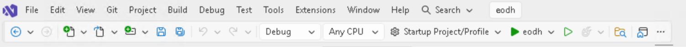

# EODH ArcGIS Pro Plugin

Search, filter, preview, and load datasets from the [UK EO Data Hub](https://eodatahub.org.uk) directly within ArcGIS Pro.

## Features

- Browse STAC catalogs and collections
- Search datasets by area of interest, date range, and cloud cover
- Preview results with thumbnails and a timeline view
- Load COG/GeoTIFF assets directly into ArcGIS Pro as map layers
- Purchase commercial satellite imagery (Airbus, Planet)
- Manage workspace assets

## Development

### Prerequisites

- Windows 10/11 (x64)
- [Visual Studio 2022](https://visualstudio.microsoft.com/) (17.8+) with the **.NET desktop development** workload
- [ArcGIS Pro](https://www.esri.com/en-us/arcgis/products/arcgis-pro/overview) 3.6+ installed locally (provides the SDK assemblies)

### Getting started

1. Clone the repository
2. Open `eodh.slnx` in Visual Studio
3. Build and run (use the green arrow button as shown below) — the debugger will launch ArcGIS Pro with the add-in loaded


### Running tests

Unit tests (no ArcGIS Pro required):

```
dotnet test -p:SkipArcGISTargets=true
```

Full test suite including integration tests (requires ArcGIS Pro):

```
dotnet test -s eodh.Tests/test.runsettings
```

## Project structure

```
Config.daml          ArcGIS Pro add-in manifest
Module1.cs           Add-in entry point
Models/              STAC data models (catalogs, items, assets)
Services/            API clients and caching (AuthService, StacClient, LayerService)
Tools/               Pure helpers (BboxMath, AssetSelector, FileDownloader)
ViewModels/          MVVM view models
Views/               WPF/XAML views
eodh.Tests/          Unit and integration tests (xUnit)
```

## Configuration

The plugin connects to the EODH API and supports three environments:

| Environment | URL                                |
|-------------|------------------------------------|
| Production  | https://eodatahub.org.uk           |
| Staging     | https://staging.eodatahub.org.uk   |
| Test        | https://test.eodatahub.org.uk      |

Authentication requires an EODH username and API token. Credentials are encrypted and stored locally using Windows DPAPI.
