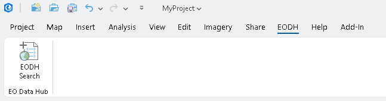
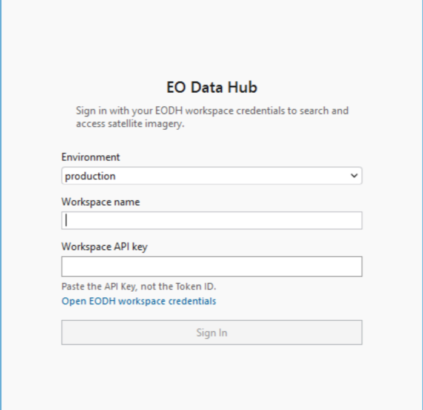
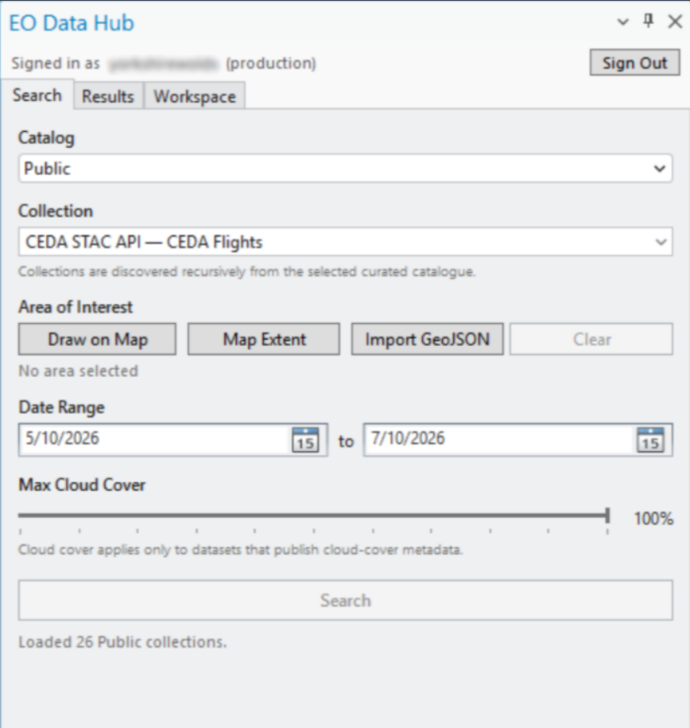
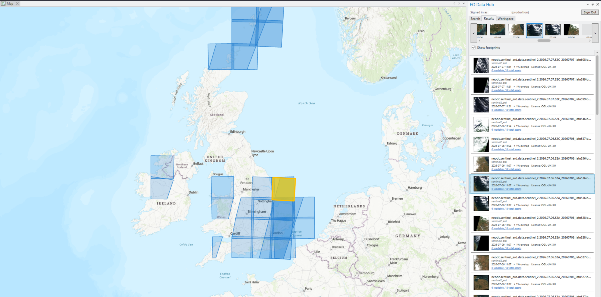
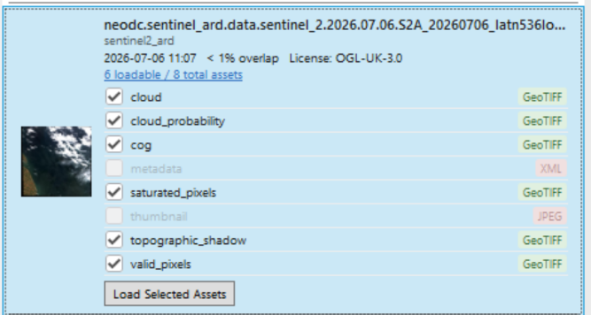
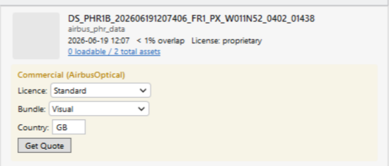
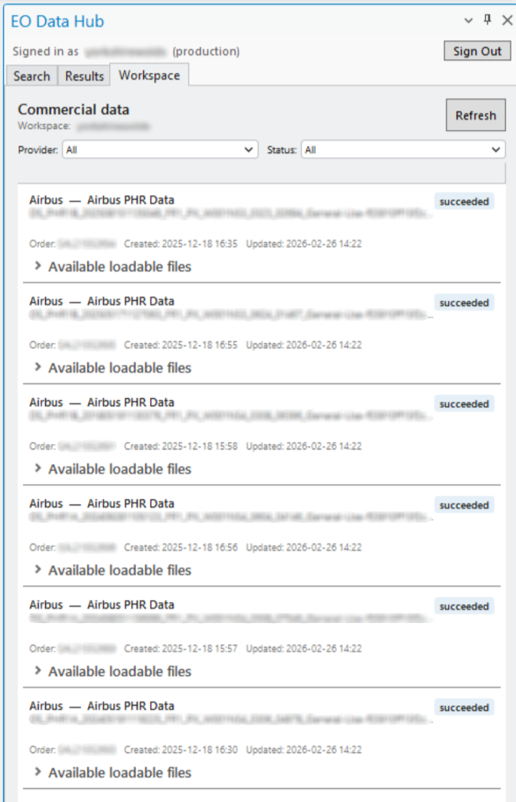

# EODH Plugin for ArcGIS Pro — Usage Guide

The EODH plugin brings the [Earth Observation Data Hub](https://eodatahub.org.uk) into ArcGIS Pro. It supports curated dataset search, temporary result footprints, loading supported assets, commercial quotes and orders, and commercial order records for one authenticated workspace.

## Requirements

- Windows 10/11 (x64)
- ArcGIS Pro 3.6 or later
- An EODH workspace and a current Workspace API key

Workspace API keys expire after at most 30 days. The add-in does not renew them automatically.

## Installation

1. Download the latest `eodh.esriAddinX` from [GitHub Releases](https://github.com/EO-DataHub/eodh-arcgis/releases).
2. Double-click the file and select **Install Add-In**.
3. Restart ArcGIS Pro if it was already open.

The **EODH** tab then appears in the ArcGIS Pro ribbon.

## Signing in

1. Open the EODH dockpane from the ribbon.
2. Select Production, Staging, or Test.
3. Enter the **Workspace name**.
4. Paste the **Workspace API key** — use the API Key, not the Token ID.
5. Select **Connect**.

The key is encrypted locally with Windows DPAPI and is not written to logs. If a saved key is invalid or expired, the add-in returns to sign-in with an actionable message. Create or copy a current key from the [EODH workspace credentials page](https://docs.eodatahub.org.uk/Getting-Started/workspaces/workspace-credentials/).

Select **Sign Out** in the dockpane header to clear the saved credentials and temporary result footprints.

## Searching for data

### Select a catalogue and collection

Search exposes exactly two curated roots:

- **Public**
- **Commercial**

The add-in discovers descendant catalogues and collections at runtime. Collections appear as a flat, sorted list labelled **Provider — Collection**. Workspace, user, and internal processing catalogues are not included.

### Define an area of interest

| Method | Description |
|---|---|
| **Draw on Map** | Draw a rectangle on the active map. |
| **Map Extent** | Use the current map view as the bounding box. |
| **Import GeoJSON** | Import a `.geojson` or `.json` boundary. |
| **Clear** | Remove the current area of interest. |

The current bounding box is used for search and, where supported, commercial quote/order coordinates.

### Set dates and cloud cover

The date range defaults to the last two months. Set **Max Cloud Cover** below 100% to add a cloud predicate; 100% sends no cloud predicate. Cloud cover is meaningful only for datasets that publish cloud-cover metadata.

Select **Search** to open the current result page.

## Browsing results and footprints

The Results tab contains a synchronized timeline and results list. Selecting an item in either view selects it in the other.

**Show footprints** is enabled by default. Every valid Polygon or MultiPolygon geometry on the current result page is drawn as a temporary overlay; the selected item has a stronger highlight. Turning the option off, starting a new search, signing out, clearing results, or closing the dockpane removes the overlays. Footprints do not create layers or modify the ArcGIS project.

Each result can show its thumbnail, item and collection identifiers, acquisition time, resolution, cloud cover, AOI overlap, locational accuracy, licence, and assets. Select supported COG, GeoTIFF, or NetCDF assets and choose **Load Selected Assets**, or double-click the result.

## Commercial quotes and orders

Commercial controls depend on the detected provider:

| Provider | Licence | Product bundles | Additional fields |
|---|---|---|---|
| Airbus Optical | Required; nine provider options | Visual, General Use, Basic, Analytic | End-user country |
| Airbus SAR | Required; three provider options | SSC, MGD, GEC, EEC | Orbit; resolution except SSC; projection except SSC/MGD |
| Planet | No licence picker | Visual, General Use, Basic, Analytic | None |

To purchase:

1. Complete every visible provider field.
2. Select **Get Quote** and review the returned value, units, and message.
3. Accept the applicable licensing terms.
4. Select **Place Order** and approve the final irreversible-purchase confirmation.

A quote belongs to the exact item, AOI bounding box, provider, licence, bundle, country, and radar options used to obtain it. Changing any applicable input clears the quote and disables ordering until a new quote succeeds.

If EODH reports that provider credentials are missing, link the Airbus or Planet account in Workspace settings. See [linked accounts guidance](https://docs.eodatahub.org.uk/Getting-Started/workspaces/linked-accounts/).

## Workspace commercial data

The Workspace tab displays commercial records for the signed-in workspace only. It does not switch workspaces or show members, workflow jobs, workflow outputs, or a raw object-store browser.

Use the Provider and Status filters to review pending, processing, failed, and completed records. Backend messages, order identifiers, and timestamps are shown when available. Only completed records with supported assets show asset selection and **Load into map**. Use **Refresh** or **Retry** after a reported error.
